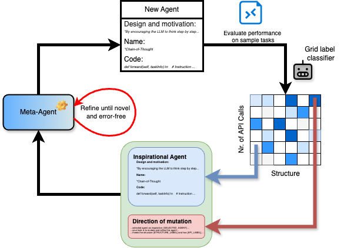

<h1 align="center">
  </a><br>
  <b>Domain-Agnostic Universal Novel Agent Design through
Autonomous, Open-Ended Evolutionary Search</b><br>
</h1>

DUNE builds on the Automated Design of Agentic Systems (ADAS) framework by integrating evolutionary search techniques to discover more diverse, higher-performing LLM agent architectures.

Our research addresses the challenge of automating agent design without incurring the steep costs and manual engineering associated with existing methods. By combining ADAS’s meta-agent search with quality-diversity algorithms and prompt evolution, DUNE consistently produces stronger LLM agents while dramatically reducing search costs compared to the original ADAS in popular benchmarks such as ARC, Drop, GPQA, MGSM, and MMLU. DUNE is open-ended, as it continues to learn new reasoning approaches throughout the evolutionary search.

We take a lot of inspiration from the NeurIPS 2024 Outstanding Paper “Autonomous Design of Agentic Systems” and recognize that our work would not be possible without the ADAS team. Their paper and repository can be found [here](https://arxiv.org/abs/2408.08435) and [here](https://github.com/ShengranHu/ADAS), respectively.

<p align="center">
</a><br>
</p>

## Our Method

DUNE consists of two complementary algorithms that build on ADAS's Meta Agent Search:

### 1. MAPADAS (MAP-Elites + ADAS)

**Key Idea:** Leverage the MAP-Elites quality-diversity algorithm to systematically explore and preserve a grid of diverse agent architectures.

#### Niche Dimensions:
- **Structural Complexity** (e.g., Chain-of-Thought, Tree-of-Thought, Multi-Agent Reasoning)
- **LLM API Call Frequency** (Few ≤ 5 calls vs. Many ≥ 6 calls)

#### Evolutionary Loop:
1. **Parent Sampling:** Choose a parent agent from the current archive, favoring high-fitness elites.
2. **Target Niche Selection:** Sample a niche (structure × API calls), weighting low-fitness niches to encourage exploration.
3. **Mutation via Meta-Agent:** Prompt the meta-agent (LLM) to mutate the parent toward the target niche.
4. **Evaluation & Archiving:** Classify the new candidate into a niche using an LLM-based classifier. If it outperforms the existing niche elite, replace it.

**Cost Savings:** By replacing GPT-3.5 with a smaller LLM (e.g., Gemini 1.5.flash-8b) for evaluation and only evaluating the top 5 candidates per iteration, MAPADAS achieves a ≈ 250× reduction in API spend compared to vanilla ADAS.

### 2. ADAS-Breeder (Prompt Evolution in ADAS)

**Key Idea:** Evolve the meta-agent's task prompt itself, rather than using a fixed prompt across all iterations, inspired by Promptbreeder.

#### Mutation Prompts:
1. Begin with a seed set of mutation prompts (from Promptbreeder).
2. On each iteration, generate new mutation prompts using the LLM and sample from them based on their historical performance in generating high-fitness agents.
3. Mutate both the task prompt and the mutation-prompt pool to steadily improve prompt quality.


## Setup
```bash
python3 -m venv venv 
pip install -r requirements.txt

# provide your OpenAI API key
export OPENAI_API_KEY="YOUR KEY HERE"

# provide your GoogleAPI key
export GOOGLE_AI_API_KEY="YOUR KEY HERE"
```

## Running Instructions

### Running Meta Agent Search

To run experiments for each domain, navigate to its respective folder. The code in each folder is self-contained. Launch experiments using the `search.py` script located in each domain's folder.

```bash
python {DOMAIN}/search.py
```

Replace `{DOMAIN}` with the specific domain folder name {`_arc`, `_drop`, `_mgsm`, ...} to run the experiment for.

### Safety Consideration
> [!WARNING]  
> The code in this repository involves executing untrusted model-generated code. We strongly advise users to be aware of this safety concern. While it is highly unlikely that model-generated code will perform overtly malicious actions in our current settings and with the models we use, such code may still act destructively due to limitations in model capability or alignment. By using this repository, you acknowledge and accept these risks.
